# Semantic Model Weaver — Architecture

## What this system does

Semantic Model Weaver is an agentic pipeline that takes a raw Snowflake database and
produces a verified, quality-scored Cortex Analyst semantic YAML — with no human authoring.

The pipeline reads the schema, classifies columns into dimensions/measures/time dimensions,
mines historical query vocabulary to ground synonym generation, enriches descriptions and
synonyms via Cortex, generates test scenarios with ground-truth answers from direct SQL,
fires those scenarios at the real Cortex Analyst API, scores results via Snowsight AI
Observability, and patches the YAML based on failures. It loops until quality converges
or the iteration budget is exhausted.


## System context

**Who uses it:** A data engineer runs the weaver CLI against a Snowflake database and schema.

**What it talks to:**
- **Snowflake** — all compute and storage. Snowpark for schema discovery and SQL execution,
  `SNOWFLAKE.ACCOUNT_USAGE.QUERY_HISTORY` for business vocabulary mining,
  `SNOWFLAKE.CORTEX.COMPLETE()` for synonym enrichment and scenario generation,
  Cortex Analyst REST API for semantic model probing, and SnowflakeConnector for TruLens
  evaluation logging.
- **Snowsight AI Observability** — the primary results UI. TruLens logs every probe record
  via OTEL spans to the Snowflake event table; Snowsight surfaces them under
  AI & ML → Evaluations. Server-side metrics (`answer_relevance`, `correctness`) are
  computed entirely inside Snowflake via `SYSTEM$EXECUTE_AI_OBSERVABILITY_RUN`.

The system has no external dependencies outside Snowflake. No OpenAI key, no separate
vector store, no additional services.


## Layers

```
┌─────────────────────────────────────────────────────────────────┐
│  CLI / Orchestration       weaver/__main__.py                    │
│  Parse args · build Snowpark session · drive pipeline loop      │
├─────────────────────────────────────────────────────────────────┤
│  Pipeline Stages           weaver/*.py                           │
│  discovery · writer · query_history · enricher ·                │
│  scenarios · probe · evaluator · refiner                        │
├─────────────────────────────────────────────────────────────────┤
│  DSL / Data Model          weaver/dsl.py                         │
│  Pydantic models for SemanticModel ↔ Cortex Analyst YAML spec   │
├─────────────────────────────────────────────────────────────────┤
│  Snowflake Platform                                             │
│  Snowpark · ACCOUNT_USAGE · Cortex COMPLETE() ·                 │
│  Cortex Analyst REST · TruLens OTEL connector                   │
└─────────────────────────────────────────────────────────────────┘
```


## Pipeline overview

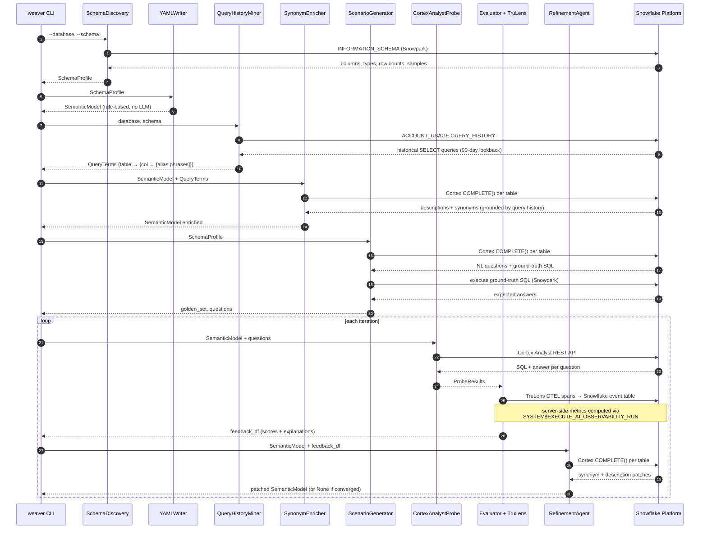


## Agentic refinement loop

The core value of the system is the **generate → test → score → refine** loop.
Each iteration produces a versioned TruLens run, so quality progression is tracked
across versions in Snowsight. The loop stops when mean correctness reaches 0.65 or
the iteration budget is exhausted.

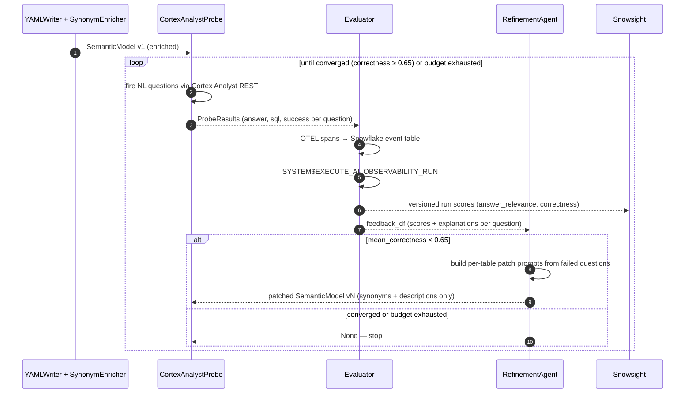


## Checkpoint and resume

The CLI writes artifacts to `manifest/{DATABASE}.{SCHEMA}/{timestamp}/` after each stage.
A failed or interrupted run can be resumed with `--resume <run_dir>` — the stage is
auto-detected from whichever artifacts are present:

| Artifacts present | Detected stage | Skipped stages |
|---|---|---|
| `model.yaml` only | `enrichment` | re-runs enrichment → scenarios → evaluation |
| `model.enriched.yaml` + `synonyms.json` | `scenarios` | skips discovery + enrichment |
| `scenarios.json` + any model YAML | `evaluation` | skips everything up to the probe loop |

```
manifest/
└── NEXTRADE_EQUITY_MARKET_DATA.FIN/
    └── 20260406_202959/
        ├── model.yaml              ← written after YAMLWriter
        ├── model.enriched.yaml     ← written after SynonymEnricher
        ├── synonyms.json           ← synonym snapshot (for inspection)
        ├── scenarios.json          ← golden_set + questions
        ├── model.iter1.yaml        ← written after each refinement iteration
        └── model.final.yaml        ← written at pipeline completion
```


## Component reference

### SchemaDiscovery — `weaver/discovery.py`

**Responsibility:** Read `INFORMATION_SCHEMA` via Snowpark and produce a `SchemaProfile` dict
that every downstream stage uses as its source of truth.

**Outputs `SchemaProfile`:**

```python
{
  "database": "NEXTRADE_EQUITY_MARKET_DATA",
  "schema": "FIN",
  "tables": [
    {
      "name": "NX_HT_BAT_REFER_A0",
      "comment": "Stock reference info — batch",
      "row_count": 72165,
      "columns": [
        {
          "name": "DWDD",
          "type": "DATE",
          "nullable": False,
          "comment": "DW date",
          "sample_values": [],          # empty for non-text columns
        },
        {
          "name": "MKT_ID",
          "type": "VARCHAR",
          "nullable": True,
          "comment": "Market ID",
          "sample_values": ["STK", "KSQ"],   # up to 5 distinct values
        },
      ],
      "fk_candidates": [
        {"column": "ISU_CD", "matches": ["NX_HT_BAT_EXECU_A0.ISU_CD"]}
      ],
    }
  ],
}
```

**Snowflake touchpoints:**
- `INFORMATION_SCHEMA.TABLES` — row counts, table comments
- `INFORMATION_SCHEMA.COLUMNS` — column names, types, nullability, comments
- Snowpark `table.sample(n=100)` — up to 5 distinct sample values for text/boolean columns

**FK inference:** Columns sharing the same name (case-insensitive) and compatible type
family (`text`, `numeric`, `date`, `timestamp`) across tables are candidates for
`Relationship` entries in the YAML.

**Type normalization:** Snowflake internal types (`FIXED`, `TEXT`, etc.) are mapped to
DSL `DataType` values (`NUMBER`, `VARCHAR`, etc.) before leaving this stage.

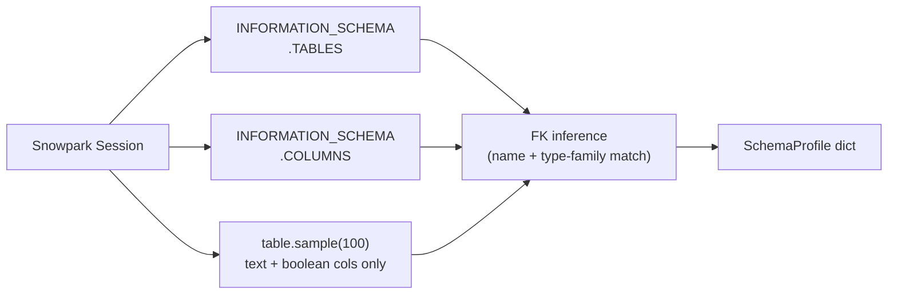


### YAMLWriter — `weaver/writer.py`

**Responsibility:** Translate a `SchemaProfile` into a `SemanticModel` using rule-based
column classification. No LLM calls — output is always structurally valid. Synonym and
description enrichment happens in the separate `SynonymEnricher` stage.

**Column classification rules:**

| Column type | Condition | DSL field |
|---|---|---|
| `DATE`, `TIMESTAMP_*` | any | `TimeDimension` |
| `VARCHAR`, `BOOLEAN` | any | `Dimension` |
| `NUMBER`, `FLOAT` | name ends with `_CD`, `_ID`, `_NO`, `_TP`, `_YN`, etc., or is a FK column | `Dimension` |
| `NUMBER`, `FLOAT` | otherwise | `Measure` (aggregation = `SUM` or `AVG` by name suffix) |
| `VARIANT`, `OBJECT`, `ARRAY` | any | skipped |

**Aggregation selection for measures:** columns ending in `_PRC`, `_RATE`, `_RATIO`, `_AVG`
get `AVG(col)`; all others get `SUM(col)`.

**Relationship inference:** One `Relationship` per unique FK pair inferred from
`SchemaProfile.fk_candidates`, typed `MANY_TO_ONE / LEFT_OUTER`.

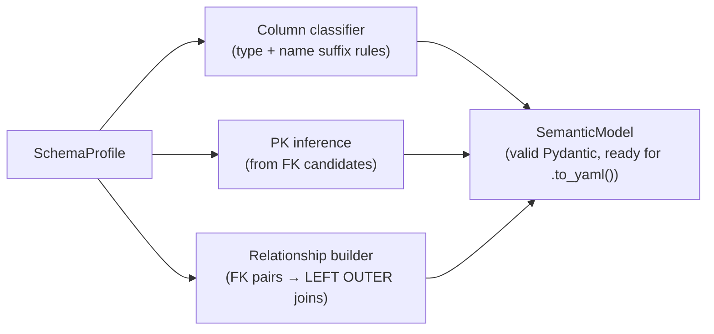


### QueryHistoryMiner — `weaver/query_history.py`

**Responsibility:** Mine `SNOWFLAKE.ACCOUNT_USAGE.QUERY_HISTORY` for the target
database/schema and extract business vocabulary — column aliases and readable phrases —
from historical SQL. These terms ground `SynonymEnricher` in real analyst usage rather
than relying solely on column names and Cortex guesswork.

**Inputs:** `database`, `schema`
**Outputs:** `QueryTerms = {table_name: {col_name: [alias_phrase, ...]}}`

**How it works:**
1. Fetches up to 1,000 successful `SELECT` queries from the last 90 days
2. Parses each query with a regex that finds `<IDENTIFIER> AS <alias>` patterns
3. Converts snake_case/camelCase aliases to readable phrases (`TRD_QTY AS trading_volume` → `"trading volume"`)
4. Filters out SQL keywords, single-character tokens, and meaningless aliases
5. Joins aliases to the tables they reference (via table-name substring match in the SQL text)

**Graceful degradation:** Returns `{}` if the view is inaccessible, the account has no
history, or no qualifying queries are found. `SynonymEnricher` proceeds with column names
and comments alone in that case.

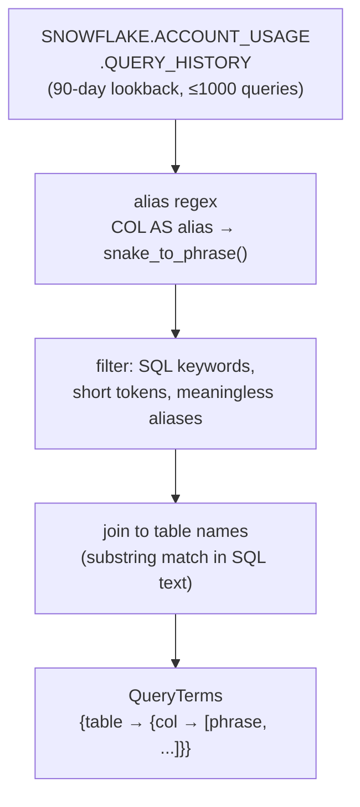


### SynonymEnricher — `weaver/enricher.py`

**Responsibility:** Enrich a `SemanticModel` with human-readable descriptions and synonyms
by calling `SNOWFLAKE.CORTEX.COMPLETE()` (mistral-large2) once per table. Only `description`
and `synonyms` fields are written — no structural changes to the model.

**Inputs:** `SemanticModel` (from YAMLWriter), `QueryTerms` (from QueryHistoryMiner)
**Outputs:** `SemanticModel` with `description` and `synonyms` populated

**Prompt strategy:**
- Includes table name, all column names + types + comments
- Injects `QueryTerms` aliases for each column as `"query-history aliases: [...]"` hints
- Asks for `{"table_description": ..., "columns": {"COL": {"description": ..., "synonyms": [...]}}}` JSON
- Temperature = 0 for deterministic output

**Validation / filtering:**
- Rejects descriptions that are just a data-type token echoed back
- Rejects synonyms that look like raw data values (ISIN codes, ticker codes, date strings, pure numbers)
- Falls back to the original column description if Cortex returns nothing usable
- Tables that fail enrichment are left unchanged (warning logged, pipeline continues)

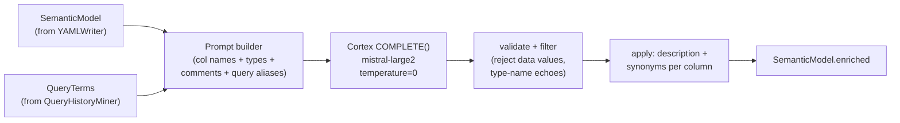


### ScenarioGenerator — `weaver/scenarios.py`

**Responsibility:** Produce the `golden_set` and `questions` lists that drive evaluation.
Questions are NL queries an analyst would realistically ask. Ground truth answers are
derived by running known-correct SQL directly against the raw Snowflake tables —
never from the generated YAML.

**Inputs:** `SchemaProfile`
**Outputs:**
- `questions: list[str]`
- `golden_set: list[dict]` — `[{"query": str, "expected_response": str}]`

**Per-table generation:**
- Cortex `COMPLETE()` (mistral-large2, temperature=0.3), one call per table
- 5 scenarios per table requested: aggregations, filters, time-based, and joins where
  related tables share column names
- Related tables are identified by overlapping column names (same heuristic as FK inference)
- Each scenario includes a fully-qualified SQL query (`DATABASE.SCHEMA.TABLE`)

**Ground truth derivation:**
- Each SQL is executed via Snowpark against the actual tables
- Result is serialized as JSON (up to 3 rows) and stored as `expected_response`
- Scenarios where SQL execution fails are silently dropped

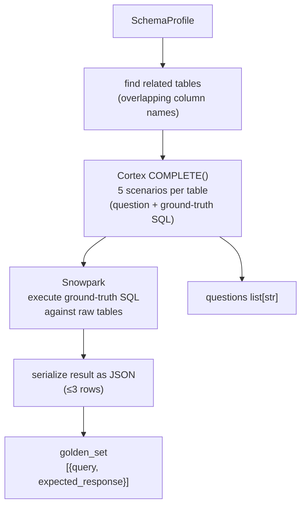


### CortexAnalystProbe — `weaver/probe.py`

**Responsibility:** Fire each NL question at the Cortex Analyst REST API with the current
draft YAML and return a structured result per question.

**Auth:** Reuses the Snowpark session token (`session._conn._conn._rest._token`) —
no separate key-pair setup required.

**HTTP flow:**

```
POST https://<account>.snowflakecomputing.com/api/v2/cortex/analyst/message
Authorization: Snowflake Token="<session_token>"
Content-Type: application/json

{
  "messages": [{"role": "user", "content": [{"type": "text", "text": "<question>"}]}],
  "semantic_model": "<yaml_text>"
}
```

**Response handling:**
- `type: "sql"` → extract SQL statement, execute via Snowpark, format result as answer string
  (top 5 rows as `col=val` pairs)
- `type: "text"` → use interpretation text as answer (fallback when no SQL)
- SQL execution failure → fall back to interpretation text
- HTTP 4xx/5xx → `success=False`, `answer=""`

Each probe instance is bound to one YAML snapshot. A new instance is created for each
refinement iteration so the updated YAML is used.

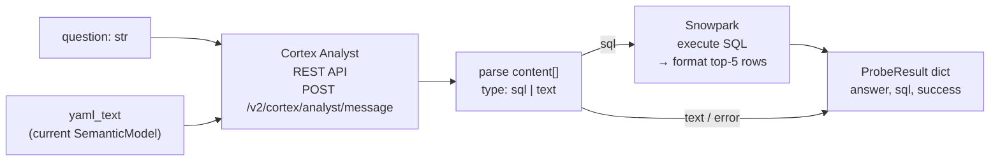


### Evaluator — `weaver/evaluator.py`

**Responsibility:** Wrap `CortexAnalystProbe` in a TruLens `TruApp`, fire all questions,
log OTEL spans to the Snowflake event table, trigger server-side metric computation, and
return per-question scores with explanations.

**OTEL / Snowflake AI Observability path (primary):**

All evaluation runs use the OTEL + Snowflake event table path — not the classic TruLens
local feedback-function approach. This avoids Cortex REST 403 errors and keeps all
computation inside Snowflake.

| Step | What happens |
|---|---|
| `build_session` | Creates `SnowflakeConnector` → `TruSession` wired to Snowflake |
| `build_tru_app` | Wraps `CortexAnalystApp` in `TruApp` (object_type=`EXTERNAL AGENT`) |
| `build_metrics` | Returns `["answer_relevance", "correctness"]` — server-side metric names |
| `run_evaluation` | Opens `live_run` context; each question is one instrumented invocation; polls until ingestion completes; triggers `run.compute_metrics()` |
| `get_results` | Queries `SNOWFLAKE.LOCAL.GET_AI_OBSERVABILITY_EVENTS()` directly; pivots scores + explanations per question; falls back to TruLens `get_records_and_feedback` if needed |

**`CortexAnalystApp`** is the TruLens-instrumented class. The `@instrument` decorator on
`ask()` tells `TruApp` to record its input (question) and output (answer string).

```python
class CortexAnalystApp:
    @instrument
    def ask(self, question: str) -> str:
        return self.probe.query(question).get("answer", "")
```

**Metrics:**

| Metric | Computed by | What it measures |
|---|---|---|
| `answer_relevance` | Snowflake server-side | Does the answer address the question? |
| `correctness` | Snowflake server-side | Does the answer match the ground truth? |

Both metrics are computed entirely inside Snowflake via `SYSTEM$EXECUTE_AI_OBSERVABILITY_RUN`.
No local Cortex SDK calls. Results are visible in Snowsight → AI & ML → Evaluations.

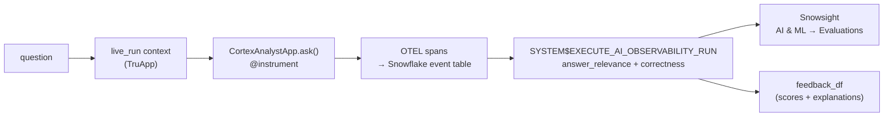


### RefinementAgent — `weaver/refiner.py`

**Responsibility:** Read `feedback_df` from the latest evaluation run, identify questions
answered incorrectly, and produce a patched `SemanticModel` with improved synonyms and
descriptions. Structural elements (table names, `base_table`, join columns, SQL expressions)
are never modified.

**Convergence check:** If mean `correctness` ≥ 0.65, returns `None` — the pipeline stops.

**Patch strategy:**
- One Cortex `COMPLETE()` call per table (mistral-large2, temperature=0)
- Prompt includes: current column definitions (name, type, description, synonyms) +
  up to 10 failed questions with explanations from Snowsight
- Response: `{"patches": {"COL": {"description": "...", "synonyms": [...]}}}` JSON
- New synonyms are appended (deduplicated) to existing ones — never replaced
- Tables with no applicable patches are left unchanged

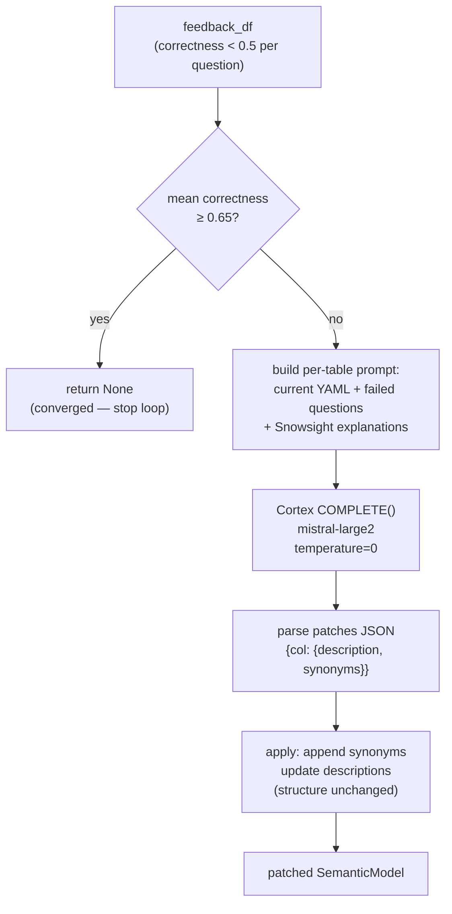


## DSL — `weaver/dsl.py`

The DSL is the single source of truth for what a valid Cortex Analyst semantic model
looks like in Python. Every pipeline stage exchanges `SemanticModel` objects — never
raw dicts or YAML strings — except at the API boundary.

### Type hierarchy

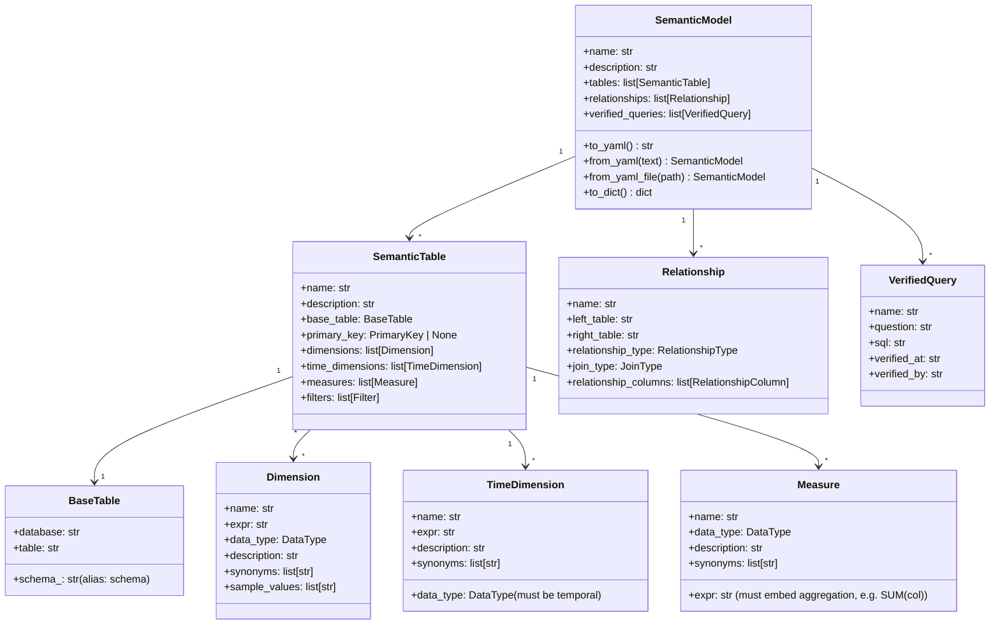

### Serialisation rules

- `SemanticModel.to_yaml()` produces Cortex Analyst-compliant YAML (ready to POST)
- Empty lists, empty strings, and `None` values are stripped from output
- `schema_` Python field serialises as `schema` in YAML (avoids shadowing Pydantic `.schema()`)
- `Measure.expr` must contain the aggregation function — `SUM(col)` not bare `col`
- `TimeDimension.data_type` is validated to be `DATE`, `TIMESTAMP_NTZ/LTZ/TZ` only

### YAML round-trip

```
SemanticModel.to_yaml() ──► YAML string ──► POST to Cortex Analyst API
                                                        │
SemanticModel.from_yaml() ◄── YAML string ◄── response / file / LLM output
```


## Data flows between stages

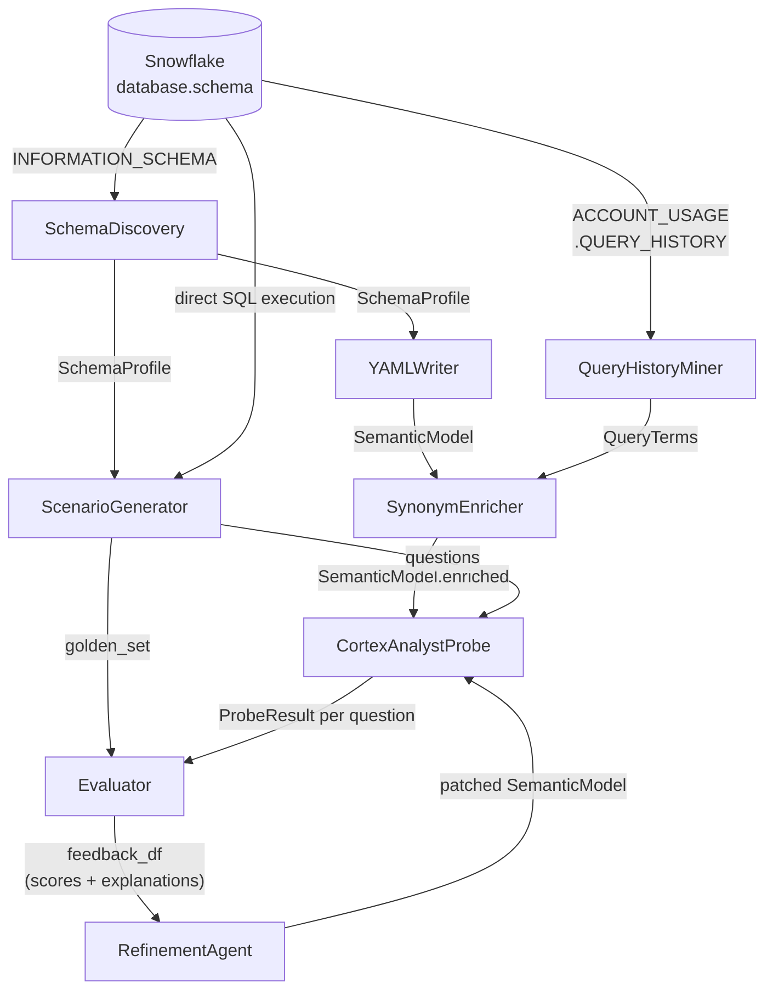

**Type contracts across boundaries:**

| From | To | Type | Key fields |
|---|---|---|---|
| `SchemaDiscovery` | `YAMLWriter` | `SchemaProfile` dict | `tables[].columns`, `fk_candidates` |
| `SchemaDiscovery` | `ScenarioGenerator` | `SchemaProfile` dict | `tables[].columns`, `row_count` |
| `QueryHistoryMiner` | `SynonymEnricher` | `QueryTerms` dict | `{table: {col: [phrase]}}` |
| `YAMLWriter` | `SynonymEnricher` | `SemanticModel` | dimensions, measures, time_dimensions |
| `SynonymEnricher` | `CortexAnalystProbe` | `SemanticModel` | `.to_yaml()` for API POST |
| `ScenarioGenerator` | `Evaluator` | `golden_set` | `[{"query", "expected_response"}]` |
| `ScenarioGenerator` | `CortexAnalystProbe` | `questions` | `list[str]` |
| `CortexAnalystProbe` | `Evaluator` | `ProbeResult` | `{"answer", "sql", "success"}` |
| `Evaluator` | `RefinementAgent` | `feedback_df` | `correctness`, `correctness_explanation`, `input` |
| `RefinementAgent` | `CortexAnalystProbe` | `SemanticModel` | patched synonyms + descriptions |


## Snowflake platform integration

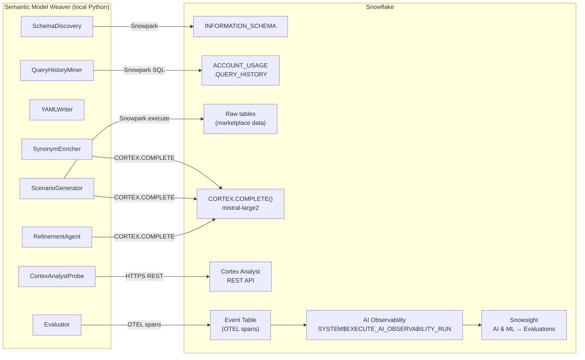

All Snowflake calls share a single `snowflake.snowpark.Session` created at startup
from `WEAVER_SNOWFLAKE_*` environment variables. The session token is reused for the
Cortex Analyst REST API (no separate auth).


## File structure

```
semantic-model-weaver/
├── weaver/
│   ├── __main__.py         CLI entry point + pipeline orchestrator + checkpoint/resume
│   ├── dsl.py              SemanticModel Pydantic DSL
│   ├── discovery.py        SchemaDiscovery — Snowpark INFORMATION_SCHEMA profiling
│   ├── writer.py           YAMLWriter — rule-based semantic model construction
│   ├── query_history.py    QueryHistoryMiner — ACCOUNT_USAGE business vocab extraction
│   ├── enricher.py         SynonymEnricher — Cortex-powered description + synonym enrichment
│   ├── scenarios.py        ScenarioGenerator — NL questions + ground truth SQL execution
│   ├── probe.py            CortexAnalystProbe — Cortex Analyst REST API test harness
│   ├── evaluator.py        Evaluator — TruLens OTEL wrapper + Snowflake AI Observability
│   ├── refiner.py          RefinementAgent — YAML patching loop
│   └── logger.py           Structured logging helpers
├── tests/
│   ├── test_dsl.py                    unit — DSL serialisation, validators (22 tests)
│   ├── test_evaluator.py              unit — TruLens wiring, probe delegation (22 tests)
│   └── test_cortex_analyst_api.py     integration — live Cortex Analyst API acceptance (4 tests)
├── manifest/
│   └── {DATABASE}.{SCHEMA}/
│       └── {timestamp}/               pipeline run artifacts (yaml, synonyms, scenarios)
├── examples/
│   └── streamlit-on-snowflake/
│       └── manifest/
│           └── nti_model.yaml         reference hand-crafted YAML (NTI — KOSPI/KOSDAQ)
├── example-queries.sql                seed queries for all 4 benchmark datasets
├── .claude/
│   ├── architecture/ARCHITECTURE.md   this file
│   ├── info/                          hackathon context, datasets, criteria
│   └── whoami/ME.md                   developer background
├── pyproject.toml                     uv project config + dependencies
└── CLAUDE.md                          project guidance for Claude Code
```


## Implementation status

| Component | File | Status |
|---|---|---|
| `SemanticModel` DSL | `weaver/dsl.py` | Done |
| `SchemaDiscovery` | `weaver/discovery.py` | Done |
| `YAMLWriter` | `weaver/writer.py` | Done |
| `QueryHistoryMiner` | `weaver/query_history.py` | Done |
| `SynonymEnricher` | `weaver/enricher.py` | Done |
| `ScenarioGenerator` | `weaver/scenarios.py` | Done |
| `CortexAnalystProbe` | `weaver/probe.py` | Done |
| `Evaluator` + TruLens OTEL wiring | `weaver/evaluator.py` | Done |
| `RefinementAgent` | `weaver/refiner.py` | Done |
| CLI + pipeline orchestrator + resume | `weaver/__main__.py` | Done |
| DSL unit tests | `tests/test_dsl.py` | Done (22 tests) |
| Evaluator unit tests | `tests/test_evaluator.py` | Done (22 tests) |
| Cortex Analyst API integration tests | `tests/test_cortex_analyst_api.py` | Done (4 tests) |
