# Semantic Model Forge — Architecture

## What this system does

Semantic Model Forge is an agentic pipeline that takes a raw Snowflake database and
produces a verified, quality-scored Cortex Analyst semantic YAML — with no human authoring.

The pipeline reads the schema, drafts the YAML via LLM, generates test scenarios with
ground-truth answers from direct SQL, fires those scenarios at the real Cortex Analyst
API, scores results with TruLens, and patches the YAML based on failures. It loops until
quality converges or iteration budget is exhausted.

---

## System context

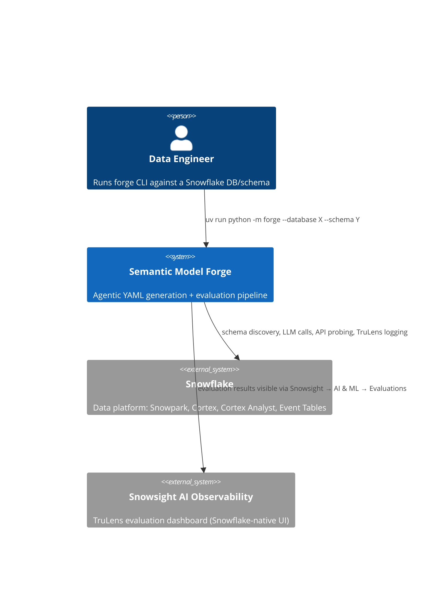

---

## Layers

```
┌─────────────────────────────────────────────────────────────────┐
│  CLI / Orchestration       forge/__main__.py                    │
│  Parse args · build Snowpark session · drive pipeline loop      │
├─────────────────────────────────────────────────────────────────┤
│  Pipeline Stages           forge/*.py                           │
│  discovery · writer · scenarios · probe · evaluator · refiner   │
├─────────────────────────────────────────────────────────────────┤
│  DSL / Data Model          forge/dsl.py                         │
│  Pydantic models for SemanticModel ↔ Cortex Analyst YAML spec   │
├─────────────────────────────────────────────────────────────────┤
│  Snowflake Platform                                             │
│  Snowpark · Cortex Arctic · Cortex Analyst REST · TruLens conn  │
└─────────────────────────────────────────────────────────────────┘
```

---

## Pipeline overview

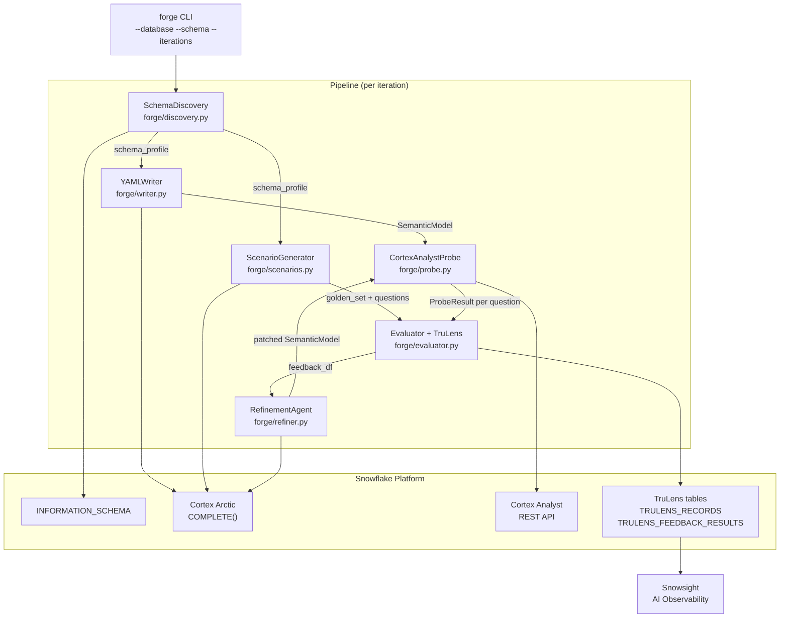

---

## Agentic refinement loop

The core value of the system is the **generate → test → score → refine** loop.
Each iteration produces a versioned TruLens run, so quality progression is tracked
across versions in Snowsight.

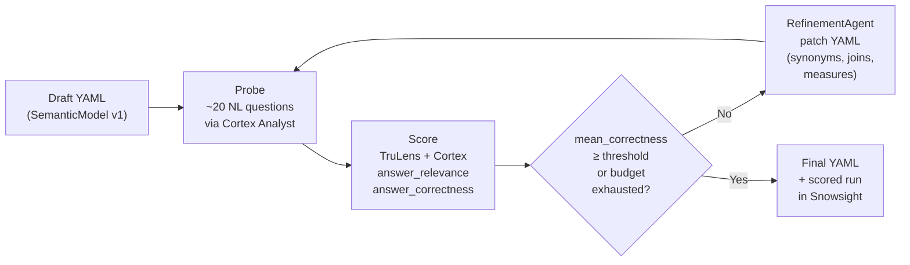

---

## Component reference

### SchemaDiscovery — `forge/discovery.py` (TODO)

**Responsibility:** Read `INFORMATION_SCHEMA` via Snowpark and produce a `SchemaProfile` dict
that every downstream stage uses as its source of truth.

**Outputs `SchemaProfile`:**

```python
{
  "database": "NEXTRADE_EQUITY_MARKET_DATA",
  "schema": "FIN",
  "tables": [
    {
      "name": "NX_HT_BAT_REFER_A0",
      "comment": "Stock reference info — batch",
      "row_count": 72165,
      "columns": [
        {
          "name": "DWDD",
          "type": "DATE",
          "nullable": False,
          "comment": "DW date",
          "sample_values": ["2025-12-15", "2026-01-23"],
        },
        ...
      ],
      "fk_candidates": [
        {"column": "ISU_CD", "matches": ["NX_HT_BAT_EXECU_A0.ISU_CD"]}
      ],
    }
  ],
}
```

**Snowflake touchpoints:**
- `INFORMATION_SCHEMA.COLUMNS` — column names, types, nullability, comments
- `INFORMATION_SCHEMA.TABLES` — row counts, table comments
- Snowpark `DataFrame.sample()` — sample values per column for dimension hint

**FK inference heuristic:** columns sharing identical name + compatible type across tables
are candidates for `Relationship` entries in the YAML.

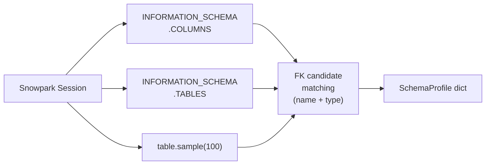

---

### YAMLWriter — `forge/writer.py` (TODO)

**Responsibility:** Translate a `SchemaProfile` into a `SemanticModel` (the DSL object)
using Cortex Arctic as the generation LLM. The output is a first-draft semantic YAML
that describes tables, dimensions, measures, time dimensions, synonyms, and joins.

**Inputs:** `SchemaProfile`
**Outputs:** `SemanticModel` (validated Pydantic object, ready for `.to_yaml()`)

**LLM prompt strategy:**
- System prompt embeds the Cortex Analyst YAML spec and column-type → field-type
  mapping rules (e.g. `DATE` columns become `time_dimensions`, numeric columns with
  aggregation semantics become `measures`)
- User prompt inlines the full `SchemaProfile` for the target schema
- Structured output: LLM is asked to produce a valid YAML which is then parsed via
  `SemanticModel.from_yaml()` and validated by Pydantic
- On parse failure: retry with error message appended to the prompt (up to 3 retries)

**Snowflake touchpoints:**
- `snowflake.cortex.complete("mistral-large2", prompt)` — generation

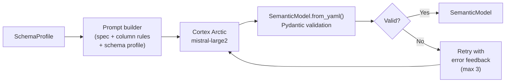

---

### ScenarioGenerator — `forge/scenarios.py` (TODO)

**Responsibility:** Produce the `golden_set` and `questions` lists that drive evaluation.
Questions are NL queries a user would realistically ask. Ground truth answers are derived
by running known-correct SQL directly against the raw Snowflake tables — never from the
generated YAML.

**Inputs:** `SchemaProfile`
**Outputs:**
- `questions: list[str]` — ~20 NL questions per table cluster
- `golden_set: list[dict]` — `[{"query": str, "expected_response": str}]`

**Question types generated (per table cluster):**
- Simple aggregation: "What is the total trading volume for KOSPI stocks last month?"
- Filter + group: "Which market has more listed stocks, KOSPI or KOSDAQ?"
- Multi-table join: "What is the average closing price per industry sector?"
- Time series: "How did daily trading value trend across January 2026?"
- Ranking: "Top 5 stocks by trading volume on 2026-01-15?"

**Ground truth derivation:** For each question, the LLM also produces an equivalent SQL
query that is executed via Snowpark against the actual tables. The result is serialised
to a short natural-language string and stored as `expected_response`.

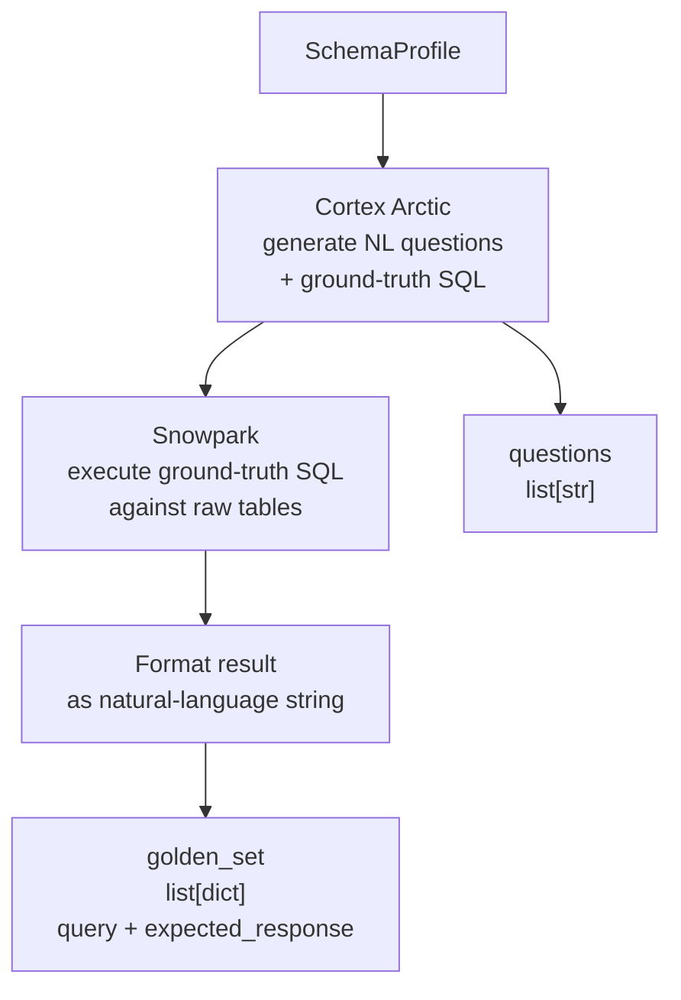

---

### CortexAnalystProbe — `forge/probe.py` (TODO)

**Responsibility:** Fire each NL question at the Cortex Analyst REST API with the current
draft YAML and return a structured `ProbeResult`.

**Interface (satisfies `evaluator.Probe` Protocol):**

```python
class CortexAnalystProbe:
    def __init__(self, session: Session, yaml_text: str) -> None: ...
    def query(self, question: str) -> dict: ...
    # Returns: {"answer": str, "sql": str | None, "success": bool, "content": list}
```

**HTTP flow:**

```
POST https://<account>.snowflakecomputing.com/api/v2/cortex/analyst/message
Authorization: Snowflake Token="<session_token>"
Content-Type: application/json

{
  "messages": [{"role": "user", "content": [{"type": "text", "text": "<question>"}]}],
  "semantic_model": "<yaml_text>"
}
```

**Response parsing:**
- Content type `"sql"` → extract SQL, execute via Snowpark, format result as answer string
- Content type `"text"` → use text directly as answer
- Content type `"error"` → `success=False`, answer=""
- HTTP 4xx/5xx → `success=False`, answer=""

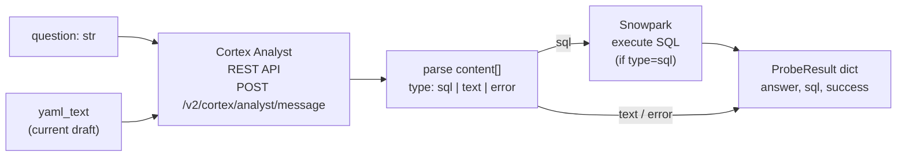

---

### Evaluator — `forge/evaluator.py` (implemented)

**Responsibility:** Wrap `CortexAnalystProbe` as a TruLens `TruApp`, fire all questions,
score results with Cortex-powered feedback functions, and log everything to Snowflake.

**Public API:**

| Function | Signature | Purpose |
|---|---|---|
| `build_session` | `(snowpark_session) → TruSession` | Wire TruSession → SnowflakeConnector |
| `build_feedbacks` | `(session, golden_set) → list[Feedback]` | Create `answer_relevance` + `answer_correctness` |
| `build_tru_app` | `(app, feedbacks, version) → TruApp` | Wrap `CortexAnalystApp` in TruApp |
| `run_evaluation` | `(tru_app, app, questions) → None` | One TruApp context per question |
| `get_results` | `(tru_session) → (records_df, feedback_df)` | Leaderboard DataFrames |

**`CortexAnalystApp`** is the TruLens-instrumented wrapper class. The `@instrument`
decorator on `ask()` tells TruApp to record its input (question) and output (answer).
The class is intentionally thin — it delegates entirely to the `Probe`.

```python
class CortexAnalystApp:
    @instrument
    def ask(self, question: str) -> str:
        return self.probe.query(question).get("answer", "")
```

**Feedback functions:**

| Name | Implementation | What it measures |
|---|---|---|
| `answer_relevance` | `Cortex.relevance_with_cot_reasons` | Does the answer actually address the question? |
| `answer_correctness` | `GroundTruthAgreement.agreement_measure` | Does the answer match the SQL-derived expected value? |

Both use the `Cortex` provider — Snowflake's `COMPLETE()` function — so no external API
keys are required. Model engine: `llama3.1-8b` for iteration, `mistral-large2` for final scoring.

**TruLens logging path:**

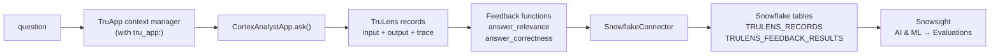

---

### RefinementAgent — `forge/refiner.py` (TODO)

**Responsibility:** Read `feedback_df` from the latest evaluation run, identify systematic
failure patterns, and produce a patched `SemanticModel`.

**Inputs:** `SemanticModel` (current), `feedback_df` (TruLens results)
**Outputs:** `SemanticModel` (patched) or `None` (no further improvements possible)

**Failure patterns → patch actions:**

| Pattern | Symptom | Patch |
|---|---|---|
| Missing synonym | Questions using colloquial terms return no SQL | Add synonyms to matching dimensions/measures |
| Wrong join | Multi-table questions return wrong results | Fix `relationship_columns` in `Relationship` |
| Unmapped measure | Aggregation questions return "I don't know" | Add or correct `Measure.expr` |
| Wrong table used | Answer correct type but wrong data | Verify `base_table` mapping |
| Time dimension absent | Date filter questions fail | Add `TimeDimension` for date columns |

**LLM prompt strategy:** Feeds Cortex Arctic the current YAML plus a structured failure
report (list of questions with low scores + their generated SQL + expected vs. actual
answers) and asks for a targeted diff to the YAML.

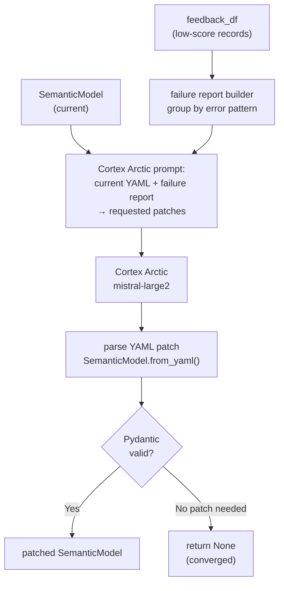

---

## DSL — `forge/dsl.py` (implemented)

The DSL is the single source of truth for what a valid Cortex Analyst semantic model
looks like in Python. Every pipeline stage exchanges `SemanticModel` objects — never
raw dicts or YAML strings — except at the API boundary.

### Type hierarchy

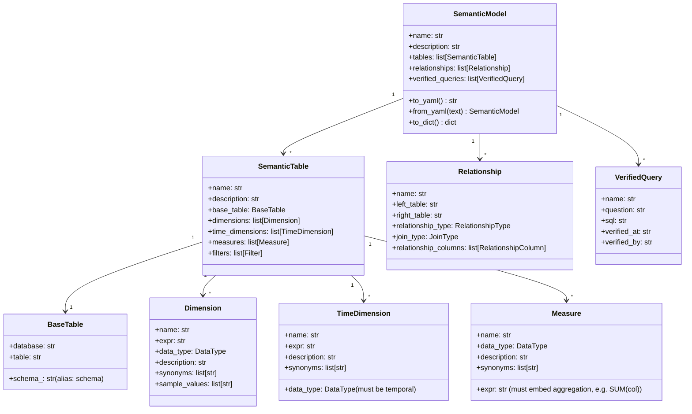

### Serialisation rules

- `SemanticModel.to_yaml()` produces Cortex Analyst-compliant YAML (ready to POST)
- Empty lists, empty strings, and `None` values are stripped from output
- `schema_` Python field serialises as `schema` in YAML (avoids shadowing Pydantic's `.schema()`)
- `Measure.expr` must contain the aggregation function — `SUM(col)` not bare `col`
- `TimeDimension.data_type` is validated to be `DATE`, `TIMESTAMP_NTZ/LTZ/TZ` only

### YAML round-trip

```
SemanticModel.to_yaml() ──► YAML string ──► POST to Cortex Analyst API
                                                        │
SemanticModel.from_yaml() ◄── YAML string ◄── response / file / LLM output
```

---

## Data flows between stages

```mermaid
flowchart TD
    DB[("Snowflake\ndatabase.schema")]

    DB -->|INFORMATION_SCHEMA| disc["SchemaDiscovery"]

    disc -->|SchemaProfile| writer["YAMLWriter"]
    disc -->|SchemaProfile| scen["ScenarioGenerator"]

    DB -->|direct SQL execution| scen

    writer -->|SemanticModel| probe["CortexAnalystProbe"]
    scen -->|questions: list[str]| probe
    scen -->|golden_set: list[dict]| eval["Evaluator"]

    probe -->|ProbeResult per question| eval

    eval -->|feedback_df| refiner["RefinementAgent"]
    refiner -->|patched SemanticModel| probe
```

**Type contracts across boundaries:**

| From | To | Type | Key fields |
|---|---|---|---|
| `SchemaDiscovery` | `YAMLWriter` | `SchemaProfile` dict | `tables[].columns`, `fk_candidates` |
| `SchemaDiscovery` | `ScenarioGenerator` | `SchemaProfile` dict | `tables[].columns`, `row_count` |
| `YAMLWriter` | `CortexAnalystProbe` | `SemanticModel` | `.to_yaml()` for API POST |
| `ScenarioGenerator` | `Evaluator` | `golden_set` | `[{"query", "expected_response"}]` |
| `ScenarioGenerator` | `CortexAnalystProbe` | `questions` | `list[str]` |
| `CortexAnalystProbe` | `Evaluator` | `ProbeResult` | `{"answer", "sql", "success"}` |
| `Evaluator` | `RefinementAgent` | `feedback_df` | `answer_relevance`, `answer_correctness`, `input`, `output` |
| `RefinementAgent` | `CortexAnalystProbe` | `SemanticModel` | patched YAML for next iteration |

---

## Snowflake platform integration

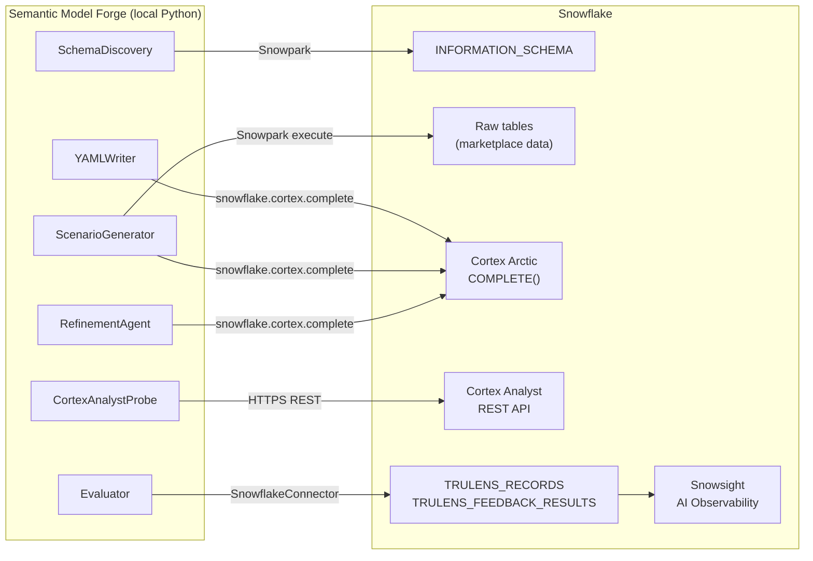

All Snowflake calls share a single `snowflake.snowpark.Session` created at startup
from `FORGE_SNOWFLAKE_*` environment variables. The session token is reused for the
Cortex Analyst REST API (no separate auth).

---

## File structure

```
semantic-model-forge/
├── forge/
│   ├── __main__.py       CLI entry point + pipeline orchestrator
│   ├── dsl.py            SemanticModel Pydantic DSL (implemented)
│   ├── evaluator.py      TruLens wrapper: CortexAnalystApp, feedbacks, run loop (implemented)
│   ├── discovery.py      SchemaDiscovery — Snowpark INFORMATION_SCHEMA profiling (TODO)
│   ├── writer.py         YAMLWriter — Cortex Arctic semantic YAML generation (TODO)
│   ├── scenarios.py      ScenarioGenerator — NL questions + ground truth SQL (TODO)
│   ├── probe.py          CortexAnalystProbe — REST API test harness (TODO)
│   └── refiner.py        RefinementAgent — YAML patching loop (TODO)
├── tests/
│   ├── test_dsl.py                unit — DSL serialisation, validators
│   ├── test_evaluator.py          unit — TruLens wiring, probe delegation (22 tests)
│   └── test_cortex_analyst_api.py integration — live Cortex Analyst API acceptance
├── examples/
│   └── streamlit-on-snowflake/
│       └── manifest/
│           └── nti_model.yaml     Reference hand-crafted YAML (NTI — KOSPI/KOSDAQ)
├── .claude/
│   ├── architecture/ARCHITECTURE.md  this file
│   ├── info/                         hackathon context, datasets, criteria
│   └── whoami/ME.md                  developer background
├── pyproject.toml                    uv project config + dependencies
└── CLAUDE.md                         project guidance for Claude Code
```

---

## Implementation status

| Component | File | Status |
|---|---|---|
| `SemanticModel` DSL | `forge/dsl.py` | Done |
| `Evaluator` + TruLens wiring | `forge/evaluator.py` | Done |
| CLI + pipeline skeleton | `forge/__main__.py` | Done (stubs wired) |
| DSL unit tests | `tests/test_dsl.py` | Done (22 tests) |
| Evaluator unit tests | `tests/test_evaluator.py` | Done (22 tests) |
| Cortex Analyst API integration tests | `tests/test_cortex_analyst_api.py` | Done (4 tests) |
| `SchemaDiscovery` | `forge/discovery.py` | TODO |
| `YAMLWriter` | `forge/writer.py` | TODO |
| `ScenarioGenerator` | `forge/scenarios.py` | TODO |
| `CortexAnalystProbe` | `forge/probe.py` | TODO |
| `RefinementAgent` | `forge/refiner.py` | TODO |

**Build order:** `scenarios.py` → `probe.py` → evaluator already done → `discovery.py` → `writer.py` → `refiner.py`
